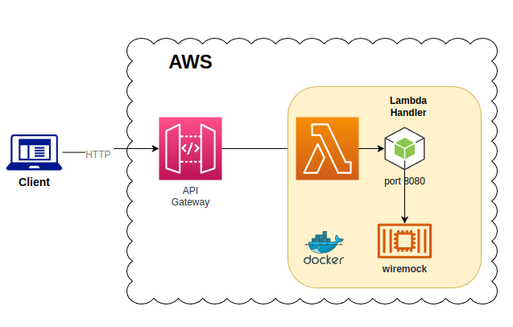
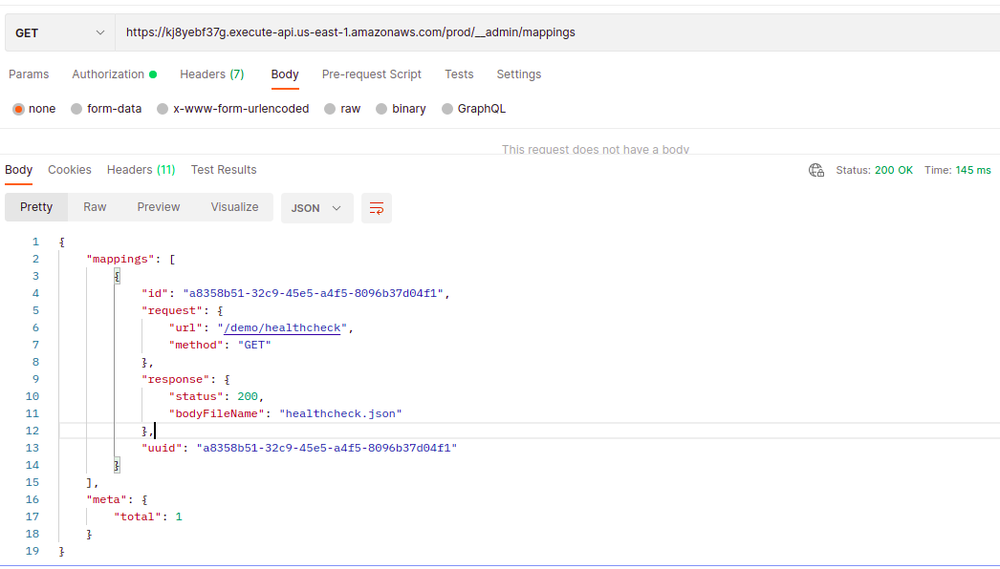
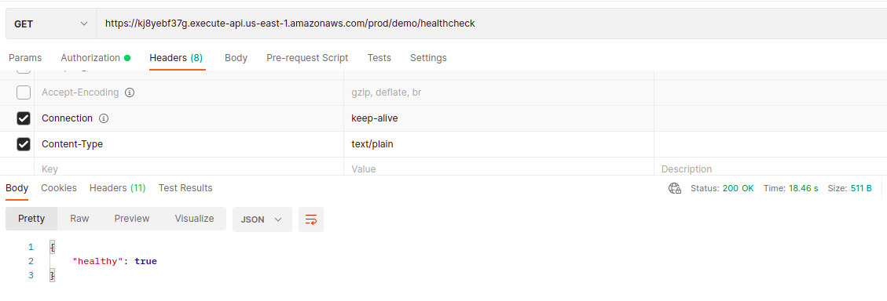

# Sample WireMock Deployment as AWS Lambda

## Goal

This project demonstrates how to deploy WireMock API simulator (http://wiremock.org/) as AWS Lambda using CDK.

Note, this is project is meant to be used for reference only and you will need to enhance it to meet your security or functional requirements (e.g. disabling public Internet access or password protecting admin APIs).

## AWS Deployment Diagram
A diagram below describes AWS deployment architecture:



## Project Structure
This repository contains two main folders:

- lambda folder with Docker container definition and JavaScript-based API Gateway event handler
- deployment folder with CDK application which deploys lambda

You can create static mock requests mappings and add them to lambda/configuration folder, similar to how a healthcheck request was defined (GET /demo/healthcheck).

## Deploy
To deploy lambda run:
``` 
$ cd ../deployment; npm i
$ cdk deploy wiremock-lambda-demo
```

API Gateway Endpoint URL can be copied from the stack output:

```
Outputs:
wiremock-lambda-demo.WiremockLambdaRestAPIEndpoint21C771BB = https://kj8yebf37g.execute-api.us-east-1.amazonaws.com/prod/
Stack ARN:
arn:aws:cloudformation:us-east-1:1234567890:stack/wiremock-lambda-demo/0c674aa0-f76b-11ec-9d96-1268ab70c2b9
```

## Test WireMock Deployment

### Admin API - Get all mappings


### Test predefined mapping


DISCLAIMER: This project, code samples and the documentation are provided "as is" without warranty of any kind, either express or implied. Use at your own risk.

We make makes no warranty that

- the software will meet your requirements
- the software will be uninterrupted, timely, secure or error-free
- the results that may be obtained from the use of the software will be effective, accurate or reliable
- the quality of the software will meet your expectations
- any errors in the software obtained from us will be corrected.

We assume no responsibility for errors or omissions in the software or documentation.
